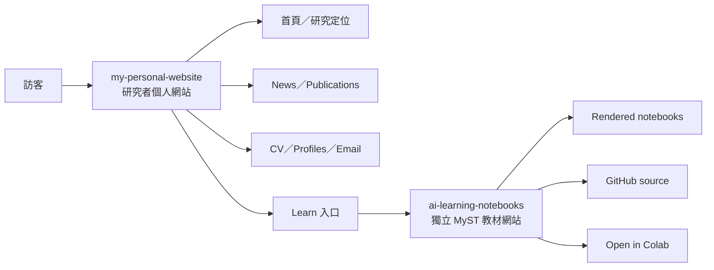
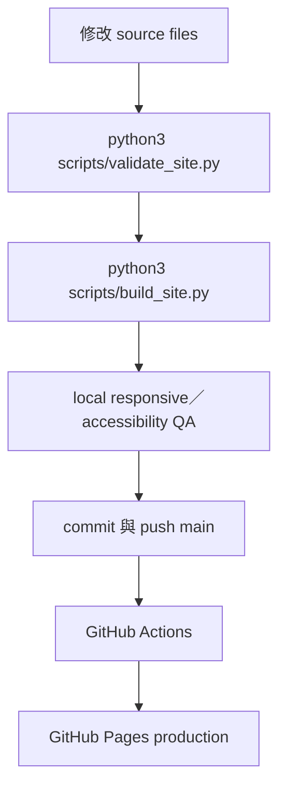

# Chung-En (Johnny) Yu — 個人網站

> 狀態：Option A 主網站與獨立 MyST 教材網站均已部署至 GitHub Pages，並使用分離的 repositories 與 deployment workflows。

這個 repository 是 Chung-En (Johnny) Yu 的研究者個人網站。公開頁面以英文呈現；提供給使用者與 agents 閱讀的 planning、decision、operation 文件則預設使用繁體中文。

## 網站設計

- 視覺方向：以清楚的研究者網站為資訊基礎，加入較成熟的 editorial typography 與留白。
- 字體：self-hosted `Newsreader`（display）與 `Inter`（body），不依賴 Google Fonts 或 runtime CDN。
- 技術：semantic HTML、modern CSS、少量原生 JavaScript（email copy feedback）、零 production dependency。
- 主內容：研究定位、selected publications、news、Learn、CV 與聯絡方式。
- Hosting：主網站與教材網站皆使用 GitHub Pages，但維持獨立 repository 與 deployment lifecycle。



## Repository 架構

```text
github-center/
├── personal-website/          # 主網站 repository
│   ├── index.html
│   ├── news/
│   ├── publications/
│   ├── research/
│   ├── learn/
│   ├── assets/
│   ├── scripts/
│   └── docs/
└── ai-learning-notebooks/     # 獨立 MyST 教材 repository
```

兩個 repositories 是相鄰但完全獨立的 checkouts，各自擁有 Git history、remote 與 GitHub Pages workflow。主網站不會在 build 時依賴教材 repository；兩站只透過公開 URL 互相連結。

## 本機執行

主網站不需要安裝 package：

```bash
python3 scripts/validate_site.py
python3 scripts/build_site.py
python3 -m http.server 8000 --directory _site
```

接著開啟 `http://localhost:8000/`。`_site/` 是 generated artifact，已加入 `.gitignore`，不可 commit。

MyST 教材網站：

```bash
cd ../ai-learning-notebooks
npx --yes mystmd start
```

驗證實際 GitHub Pages base path：

```bash
cd ../ai-learning-notebooks
BASE_URL=/ai-learning-notebooks npx --yes mystmd build --html
```

MyST build 只 render 已存在的 notebook outputs，不在 CI 執行昂貴或需要 network 的 notebook code。

## Deployment 流程



主站 workflow 會重新執行 validation、建立乾淨的 `_site/` artifact，再透過官方 Pages actions 發布。GitHub Pages 不需要 long-lived deploy key；workflow 只使用 repository 提供的 `GITHUB_TOKEN` 與 least-privilege permissions。

## 文件入口

- [內容與舊站盤點](docs/planning/01-content-inventory.md)
- [設計研究與 skill 候選清單](docs/planning/02-design-research.md)
- [網站架構、notebooks 與部署方案](docs/planning/03-architecture-and-deployment.md)
- [實作與驗證計畫](docs/planning/04-implementation-and-validation-plan.md)
- [已核准網站方向](docs/decisions/0001-approved-site-direction.md)
- [已安裝 skills 與安全紀錄](docs/decisions/0002-installed-skills.md)
- [視覺系統](docs/design/visual-system.md)
- [維護與內容更新手冊](docs/operations/maintenance.md)
- [Agent 作業規範](AGENTS.md)

## Repository 與 credentials

- `personal-website` 與 `ai-learning-notebooks` 必須維持獨立 repositories，不建立 nested repository 或 submodule dependency。
- 不得 reset、覆寫或 commit 教材 repository 內既有的 `.DS_Store` 變更。
- 不得將 SSH keys、tokens、cookies、`.env` 或其他 credentials 寫入 repository。
- GitHub SSH credentials 只能留在使用者的 global environment；repository 內不保存副本。
