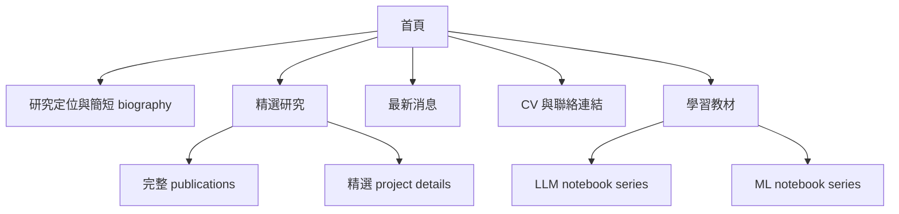

# 內容與舊站盤點

Review 日期：2026-08-11

## 個人定位

舊站資料足以支持一個清楚的定位敘述：

> Chung-En (Johnny) Yu 是一位 Ph.D. candidate 與 AI researcher，研究重點是面向高風險真實應用的可靠 multimodal 與 agentic AI systems。

主要研究主題：

- Reliable agentic AI systems
- Multimodal foundation models 與 VLMs
- Uncertainty quantification、abstention 與 hallucination detection
- Adversarial robustness

延伸研究主題：

- Neurosymbolic AI 與 cybersecurity
- Remote sensing
- Robotics、SLAM、optimal estimation 與 robust control
- Teaching 與教材開發

公開網站應優先呈現這項研究者定位，而不是先列出通用 programming skills。

## 可使用的內容

| 內容 | 舊站來源 | 建議用途 |
|---|---|---|
| Biography、research interests、education、profile links | `00-home.md` | 改寫為簡短的第一人稱介紹與精簡研究重點 |
| Publications、paper／code links、venues | `01-publication.md` 與 CV | 建立 structured publication entries，並精選 3–4 篇 first-author works |
| News | `03-news.md` | 首頁只保留較新的簡短消息，其餘移至 archive |
| CV | `CV-Chung_En_Johnny_Yu-20260624.pdf` | 完成 privacy review 後提供下載 |
| Teaching 與 service | CV | 建立精簡 section，或只在 CV 中保留完整細節 |
| Research project page | `research/2026/scoop/scoop.md` | 轉換成較完整的 project detail page，或連結至外部 project website |
| Portrait 與 social icons | `web_img/` | Portrait 經 crop／quality review 後重用；icon PNGs 改為 accessible inline SVG 或文字連結 |
| LLM learning notebooks | `02-LLM/*.ipynb` | 保留於獨立的 learning experience |
| MLP notebook | `01-ML/DL_MLP_All_Techniques.ipynb` | 保留，但發布前先最佳化 embedded outputs |

## Notebook 盤點

舊站包含六份具完整內容的 LLM notebooks：

1. Tokenization
2. Attention
3. GPT architecture
4. Pretraining
5. Fine-tuning for classification
6. Instruction fine-tuning

這些 notebooks 合計包含數百個 cells，已形成具有連貫順序的教材。另外還有一份 96-cell 的 MLP notebook，涵蓋 training、regularization、optimization 與 visualization 等主題。

重要檔案大小資訊：

- MLP notebook 約 10 MB。
- Generated `_build` directory 約 430 MB。
- `_build` 已列入舊站 `.gitignore`，未來應維持相同政策。
- CI 預設應 render notebooks 內已計算完成的 outputs，不要重新執行需要 GPU、network 或外部 dataset 的 cells。

## 現有技術與 repository 狀態

- 最上層 `personal-website/` 已初始化並發布為 `chungenyu6/my-personal-website`。
- `ai-learning-notebooks/` 已搬移為與 `personal-website/` 相鄰的獨立 Git repository，位於 branch `main`。
- 教材 repository 已 rename，local remote 是 `git@github.com:chungenyu6/ai-learning-notebooks.git`。
- `myst.yml`、README 與 local remote 已統一使用 canonical repository `chungenyu6/ai-learning-notebooks`。
- 教材 repository 的 Git status 包含使用者擁有的 `.DS_Store` 本機變更，必須保留。
- 目前的 GitHub Action 可以使用 MyST／Jupyter Book build 並部署至 Pages，代表 notebooks 本身可透過 static hosting 發布。

## Migration 時需要處理的內容問題

- 修正 spelling 與 grammar，包括 institution names 與多處舊站 typos。
- 對照 Markdown publication page 與 2026 年 6 月 CV，統一 publication year 與 venue 的描述。
- 確認各研究成果應標示為 published、workshop、proceedings、submitted 或 preprint。
- 將 hard-coded 舊站 publication URLs 改為穩定的 relative paths 或 direct paper links。
- 若 `04-conference_tracker.md` 等 table-of-contents targets 不存在，應補齊或移除。
- 修復 SCoOP page 的 internal image paths，並統一大小寫為 `SCoOP`，不要使用 `SCOOP`。
- 決定網站文案採第一人稱或第三人稱；首頁建議使用第一人稱。
- 公開 PDF 前，先 review CV 中的個人資訊。

## 建議內容階層

## 建議 content model

重複出現的內容應保存在 structured data 中，不要在多個頁面重複撰寫 markup：

- `profile`：name、title、affiliation、short bio、interests、links
- `news`：date、text、optional URL
- `publications`：year、title、authors、venue、status、paper／code／project links、featured flag
- `projects`：title、summary、image、methods、results、links
- `teaching`：course、role、dates、summary

依最後核准的 stack，implementation 可以將資料保存在 JSON、YAML 或小型 static module。目標是讓未來 agents 只需更新一次 publication data，不必同步修改多個頁面。
