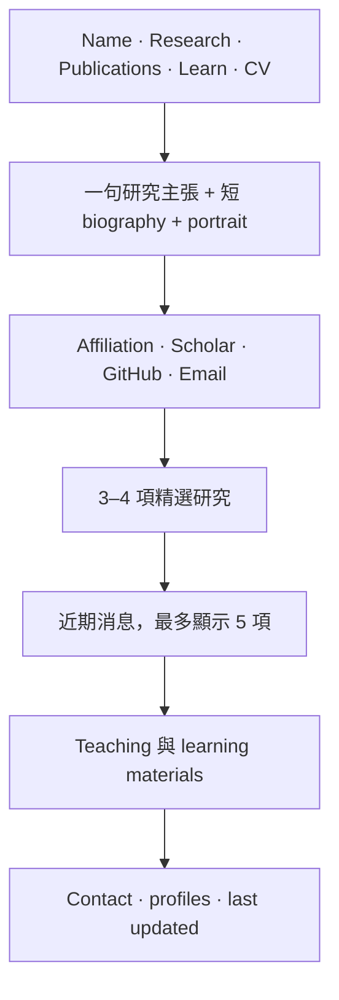

# 設計研究與 Skill 候選清單

Review 日期：2026-08-11

## 其他 researcher websites 值得參考的做法

值得學習的不是某一個特定 template，而是它們都會穩定地優先呈現研究者身分、研究重點、精選成果與可信的外部連結。

| 參考網站 | 觀察到的設計模式 | 對本網站的啟示 |
|---|---|---|
| [Jeremy Bernstein](https://jeremybernste.in/) | 非常精簡的 navigation、鮮明個人照片、帶有個性的配色與 editorial pacing | 個性可以來自單一主色與大量留白，不需要堆疊許多 components |
| [Deepayan Das](https://deepayan137.github.io/) | 置中的 academic identity、serif typography、直接的 Scholar／GitHub links 與 featured publications | 較窄的閱讀欄寬與清楚研究連結，可以快速建立年輕 researcher 的專業形象 |
| [Andrea Amaduzzi](https://andreamaduzzi.github.io/) | 傳統 academic website 的資訊密度，包含 portrait、timeline 與 publications | 內容範圍值得參考，但新網站應降低資訊密度與裝飾性 separators |
| [Reza Salehi](https://homes.cs.washington.edu/~mrsalehi/) | 現代 Inter typography、克制的 cool-gray palette、compact navigation 與 publication-first structure | 簡單的 systems-style layout 很容易擴充，但若缺乏 editorial voice，可能顯得過度通用 |
| [Peiran Wu](https://wpr001.github.io/) | 簡短 biography、news、publication cards 與直接的 social links | 可作為現代 multimodal-AI Ph.D. profile 的實用 baseline |
| [Jia Li](https://jiali-home.github.io/) | 與 Johnny 研究方向接近的 research-first positioning | 第一個 viewport 應先說明研究範圍，而不是先呈現完整職涯時間線 |

## 三種可供 review 的視覺方向

### A. Warm editorial minimal — 建議方向

參考 Anthropic 的克制感、語氣與 typography，但不複製其設計。

- 使用 warm off-white background、charcoal text，以及單一 muted terracotta／copper accent。
- Display text 使用具有表現力的 open-source serif；interface 與 metadata 使用中性的 sans-serif。
- 候選 font pairings：`Newsreader + Inter`、`Source Serif 4 + Inter` 或 `Literata + Manrope`。
- 使用較寬的 page margins、較短的 line length、thin rules 與安靜的 hover states。
- 精選研究以 editorial entries 呈現，可搭配小型 image 或 diagram，不使用全部長得一樣的 SaaS cards。
- 可為單一 featured research result 使用 dark section，但不需要預設整站 dark theme。

適合原因：能傳達深思熟慮、成熟與溫度，同時保有辨識度與簡潔性。

### B. Classic academic clean

- White background、dark text 與克制的 blue links。
- Body 或 headings 使用 serif，採單一置中 column，portrait 放在 introduction 附近。
- Publications 與 news 是主要的視覺結構。
- 幾乎不使用 custom graphics 與 motion。

適合原因：最容易維護，而且 academic visitors 很熟悉這種結構。風險是可能看起來像 default template。

### C. Modern systems minimal

- 全站使用 Inter／system sans-serif。
- 使用 cool-gray surfaces、compact sticky navigation，以及 grid-based featured projects。
- 可選擇加入 dark mode 與低調的 tag metadata。

適合原因：乾淨且具有現代技術感。風險是可能看起來像通用 developer portfolio，無法充分呈現研究者的 editorial personality。

## 建議首頁結構

在 mobile 上，頁面應維持自然的單欄閱讀順序。Navigation 可以換行或 collapse，但核心連結不應隱藏在複雜互動中。

## 明確不採用的設計

- 不使用 skill percentage bars。
- 不使用 animated particle backgrounds 或 3D effects。
- Publications 不使用 carousel。
- 不建立冗長的 technology logo wall。
- 不使用遮蔽研究定位的大型 hero slogan。
- 不複製 Anthropic logo、proprietary font、illustration 或完整 visual system。
- 不使用妨礙閱讀或忽略 reduced-motion preferences 的 animation。

## UI/UX skill 候選

> Status update（2026-08-11）：使用者已核准並完成安裝 `frontend-design` 與 `web-design-guidelines`。實際版本、source、license、permissions 與 removal path 以 `docs/decisions/0002-installed-skills.md` 為準；本文件保留當時的候選評估紀錄。

| 候選 skill | Source | 最適合的用途 | 建議 |
|---|---|---|---|
| `frontend-design` | [Anthropic skills repository](https://github.com/anthropics/skills/blob/main/skills/frontend-design/SKILL.md) | 建立具有辨識度的第一版 frontend，避免通用 AI-generated styling | 可考慮用於第一版 visual prototype；安裝前必須先檢查內容 |
| `web-design-guidelines` | [Vercel agent-skills](https://github.com/vercel-labs/agent-skills) | Audit UI code 的 accessibility、focus、typography、interaction、images 與 responsive behavior | 建議用於實作後 review，不作為 visual identity generator |
| `web-quality-skills` | [Addy Osmani](https://github.com/addyosmani/web-quality-skills) | Lighthouse、Core Web Vitals、accessibility、SEO 與 best-practice audits | 建議接近 release 時使用，而且只安裝真正需要的細分 skills |
| `jupyter-notebook` | OpenAI curated skills list | 維護 notebook 內容與驗證 | 只有在 Learn site 進入主動維護階段後再考慮 |
| `playwright` | OpenAI curated skills list | Browser-based regression checks | Optional；目前 Codex browser capability 可能已足以處理 visual QA |

## Skill 選擇建議

這是一個小型專案，第三方 design skills 最多使用兩個：

1. 若使用者核准，在第一次 prototype 階段使用 Anthropic `frontend-design`。
2. 若使用者核准，在 audit 階段使用 Vercel `web-design-guidelines`，或選擇 Addy Osmani 中必要的 quality skills。

一開始就安裝大型 bundle 只會增加 context 與 supply-chain surface，無助於目前的規劃決策。本文件中的 visual brief 應持續作為 source of truth。

## 請使用者 review

請選擇一種視覺方向：

- **A — warm editorial minimal**（建議）
- **B — classic academic clean**
- **C — modern systems minimal**

也可以混合選擇，例如「採用 A 的 typography 與 palette，但使用 B 的資訊密度」。
