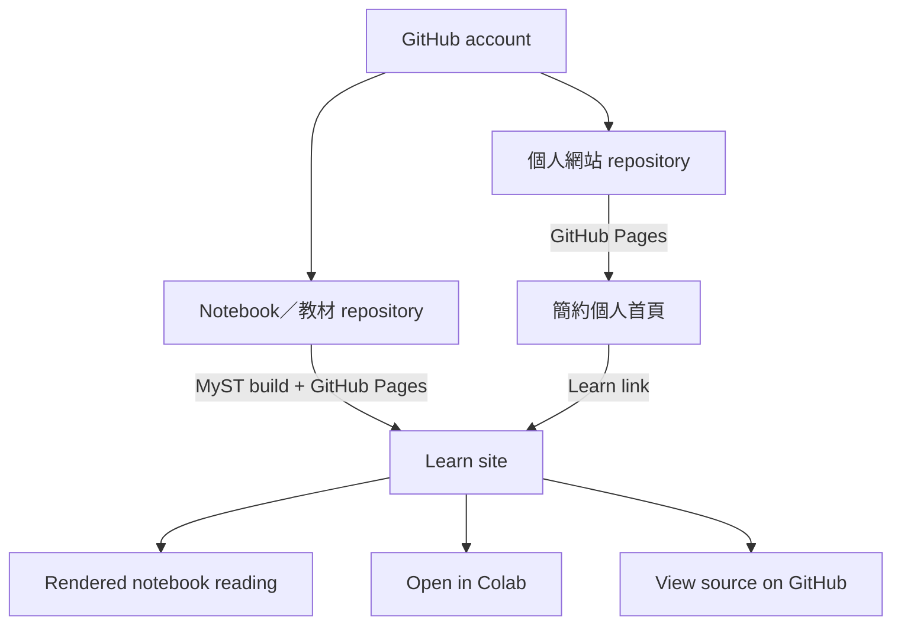

# 網站架構、Notebooks 與部署方案

Review 日期：2026-08-11

## 簡短結論

GitHub Pages 足以支援這個專案。它可以同時 host 個人網站，以及由 Jupyter Notebooks 產生的 static HTML。現有 MyST workflow 已證明這批 notebooks 可以透過 static hosting 發布。

建議的簡化方式不是放棄 MyST，而是不再使用 MyST 作為個人首頁的 framework。

## 建議架構：兩個小型靜態網站



優點：

- 首頁維持快速、具有客製視覺，而且容易編輯。
- Notebook site 保留 MyST 的 code、math、table of contents、cross-references、downloads 與 Colab links。
- 較重的 notebook build 即使失敗，也不會阻擋 biography 或 publication updates。
- 每個 repository 都有清楚目的，也能減少 agent 每次需要理解的 context。
- 2026-08-11 經使用者核准，舊個人網站 repository 已 rename 為 `ai-learning-notebooks`，並重新定位為獨立 MyST／Notebook 教材站。

取捨：訪客閱讀教材時會前往另一個 GitHub Pages path。只要保留一致 branding 與清楚的返回連結，這項成本可以接受。

## 比較過的選項

| 選項 | 複雜度 | Notebook 閱讀體驗 | 視覺控制 | 建議 |
|---|---:|---:|---:|---|
| Plain static homepage；notebooks 只放 GitHub／Colab | 最低 | 足夠，但閱讀性較差 | 高 | 如果不想維護 MyST，這是合理 fallback |
| Static homepage + 獨立 MyST Learn site | 低至中 | 很好 | 主網站高 | **建議採用** |
| 單一 repository，同時 build custom homepage 與 `/learn/` 下的 MyST | 中至高 | 很好 | 高 | 第一版不建議；CI 與 base-path routing 較容易出錯 |
| 整個網站都使用 MyST book | 中 | 很好 | 未修改 theme 時較低 | 目前模式；不建議沿用於 redesign |
| Vercel／Netlify／Cloudflare Pages | 低至中 | 依 build 而定 | 高 | 適合 previews，但目前沒有相對 GitHub Pages 的明顯優勢 |

## 為什麼可以保留 MyST

目前 MyST documentation 確認它能夠：

- 將 `.ipynb` files 轉換成 static HTML。
- 將 generated static files 部署到 GitHub Pages。
- 預設不執行 notebooks，直接保留 precomputed outputs。
- 在明確指定時進行 build-time execution。
- 支援以 GitHub／Colab 為核心的教材 workflow。

參考來源：

- [MyST deployment guide](https://mystmd.org/guide/deployment)
- [MyST notebook execution guide](https://mystmd.org/guide/execute-notebooks)
- [GitHub Pages custom workflows](https://docs.github.com/en/pages/getting-started-with-github-pages/using-custom-workflows-with-github-pages)

這個專案初期不建議在 CI 重新執行 notebooks。部分 notebooks 可能需要下載資料、model weights、GPU 或特定 package versions，容易造成 Pages build 緩慢且不可靠。較好的方式是將 review 過的 outputs 保存在 notebooks 中，build 時只 render，並保留「Open in Colab」作為可重現的互動入口。

## 建議 repository layout

以下是目標架構，並非目前已實作的結構：

```text
personal-website/
├── AGENTS.md
├── README.md
├── docs/
│   ├── planning/
│   └── decisions/
├── site/
│   ├── index.html
│   ├── publications/
│   ├── research/
│   ├── assets/
│   └── data/
├── scripts/
│   └── validate-links.*
├── tests/
│   └── smoke.*
└── my-old-web/          # 本機舊站來源；不要 commit 到新 repository
```

如果使用者核准 no-build static implementation，可以直接 publish `site/`。如果未來 structured content generation 的價值變得明確，再加入小型 static-site generator；version one 並不需要這項複雜度。

## 部署平台建議

Version one 建議使用 GitHub Pages，原因如下：

- 網站是 public static site。
- GitHub 已經 host code 與 research links。
- HTTPS、custom domains 與 Actions-based deployment 已足夠。
- 不需要 forms、authentication、server functions 或 database。
- 可以減少 accounts、billing surfaces、plugins 與 credentials。

只有在 preview deployments、advanced redirects、serverless functions、analytics 或 CMS 成為明確需求時，才值得重新評估 Cloudflare Pages、Netlify 或 Vercel。

## Credentials 與 Git 狀態

- 本機存在 GitHub CLI account entry，但其 token 目前無效。
- 舊站 repository 使用 SSH remote。
- Sandbox 無法查詢本機 SSH agent，因此尚未驗證 SSH authentication。
- 規劃階段不需要處理 credentials。
- 第一次 push 前，應先確認確切 target repository，並測試 SSH access；過程中不得顯示或複製 private key material。
- GitHub Pages deployment 應使用 Actions 提供的 short-lived repository token 與 least-privilege permissions，不應在 repository 中使用 personal access token。

## 部署安全規則

- 不要 commit `_build`、notebook caches、virtual environments、`.env` 或 OS metadata。
- 重要 CI actions 與 runtime versions 必須 pin 或經過明確版本管理。
- CI 應從 clean checkout 開始 build。
- Project site 必須設定並測試正確的 GitHub Pages base path。
- Default Pages deployment 不得執行依賴 network 或 GPU 的 notebook cells。
- 先確認預設 `github.io` URLs 穩定運作，再加入 custom domain。
